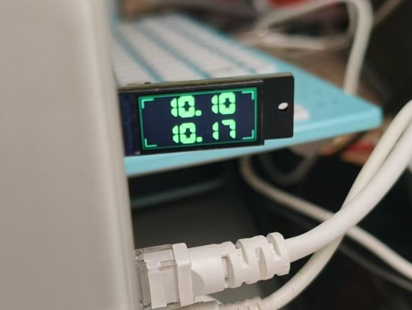
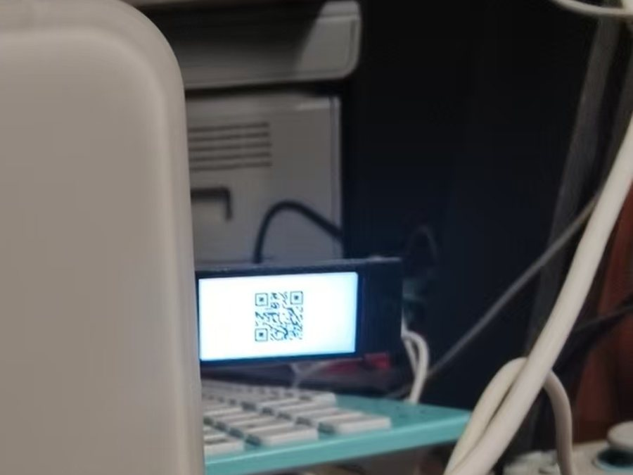
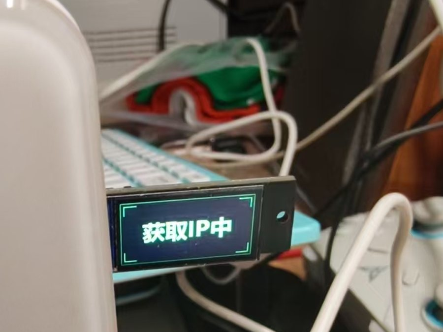

# MSU2 IP Display

有时候我们会遇到这种情况，把一个无头设备例如一个网络盒子拿去现场部署，因为不知道对方网络情况或者盒子是批量刷的，不方便预先设置好只能 DHCP。但是在对方网络里面也不一定有方便的手段来找到 DHCP 出来的 IP，特别有时候只带了个手机没有电脑就很麻烦。

无聊的我就做了这么个项目。首先在 Linux 盒子里面装上配套的程序。到了现场，设备上电接好网线或者连好 wifi 以后，把一个带屏幕的小板插在 USB 口上，就可以直接显示 IP 或者二维码。

效果大概如下所示

<p align="center">
  
  
  
</p>

## 准备硬件

硬件我选择了能找到的最便宜的带屏幕小板，墨砺工作室的 MSU2 Mini，组装好的 11.9 元，散件 10.9 元，但是有 6 块钱运费。

<https://item.taobao.com/item.htm?id=841679900812>

## 快速开始

### 1. 刷写小屏资源

小屏幕需要预先处理一下，把常用显示图给刷进去（其实理论上不刷也行，但是就有些状态看着很奇怪）。因此先要刷一下，这个小板子在 win10/11 下是免驱的，直接插上就行。

从 [Latest Release](https://github.com/kxn/msu2-ip-display/releases/latest) 下载 `MSU2 Flasher`：

| 系统 | 文件 |
| --- | --- |
| Windows x64 | `MSU2.Flasher-windows-x64.exe` |
| Linux x64 | `MSU2.Flasher-linux-x64` |
| macOS Intel | `MSU2.Flasher_<版本>_x64.dmg` |
| macOS Apple Silicon | `MSU2.Flasher_<版本>_aarch64.dmg` |

打开刷写器，插入 MSU2 MINI，等待应用识别设备后点击 `写入`。刷写完成后就可以拔下来了。

Linux 版 flasher 下载后需要加执行权限：

```sh
chmod +x ./MSU2.Flasher-linux-x64
./MSU2.Flasher-linux-x64
```

### 2. 在 Linux 设备上安装 IP 显示服务

Linux 内核需要编译进 CDC ACM 支持，以及对应平台的 USB host 驱动。DEVTMPFS 也推荐编译进去，要不不能自动创建还挺费劲的。

默认安装后显示文字 IPv4 地址， 因为我老花眼了，所以故意把 IP 分了两行显示让字大一点：

```sh
curl -fsSL https://raw.githubusercontent.com/kxn/msu2-ip-display/master/scripts/install-miniboard-ipd.sh | sudo sh
```

安装后插入已经刷好的 MSU2 MINI。设备拿到 IP 后，屏幕会直接显示 IPv4。

## 显示二维码

不想还费劲输入的，可以让显示的时候不显示文字 IP 而是显示一个二维码，这样就可以用手机扫码来快速完成应用配置。默认 --show qr 会显示一个 'http://{ip}' 的二维码

```sh
curl -fsSL https://raw.githubusercontent.com/kxn/msu2-ip-display/master/scripts/install-miniboard-ipd.sh | sudo sh -s -- --show qr
```

如果希望直接一步到位给出完整地址，可以把 URL 模板写在 `--show qr:` 后面：

```sh
curl -fsSL https://raw.githubusercontent.com/kxn/msu2-ip-display/master/scripts/install-miniboard-ipd.sh | sudo sh -s -- --show 'qr:http://{ip}:8080/'
```

`{ip}` 会在运行时替换成实际 IPv4。二维码模板会在服务启动前校验长度，能放进小屏后才会进入运行状态。

## 固定网口

默认选择带默认路由的 IPv4。如果盒子有多个网卡，希望只显示某个接口时，可以在安装时指定接口：

```sh
curl -fsSL https://raw.githubusercontent.com/kxn/msu2-ip-display/master/scripts/install-miniboard-ipd.sh | sudo sh -s -- --interface eth0
```

参数会写入系统服务。重新执行安装命令就是升级，也会更新服务参数。

## 屏幕状态

| 屏幕内容 | 含义 |
| --- | --- |
| 待机动画 | 小屏已刷写资源，host 程序还没有接管显示 |
| `获取IP中` | 已连接小屏，正在等待可显示的 IPv4 |
| `DHCP失败` | 当前只有链路本地地址，或者长时间没有拿到可用 DHCP 地址 |
| 两行数字 IP | 已获取 IPv4，直接照着输入即可 |
| 二维码 | 已获取 IPv4，扫码打开模板生成的 URL |

## 常见操作

查看版本：

```sh
miniboard-ipd --version
```

前台运行，方便临时测试：

```sh
miniboard-ipd run
miniboard-ipd run --show qr
miniboard-ipd run --interface eth0
```

排查问题时启用详细日志：

```sh
curl -fsSL https://raw.githubusercontent.com/kxn/msu2-ip-display/master/scripts/install-miniboard-ipd.sh | sudo sh -s -- --debug
```

OpenRC 系统会把服务输出写到 `/var/log/miniboard-ipd.log`。其他 init 系统可以用对应的服务管理命令查看状态：

```sh
miniboard-ipd status
```

卸载服务和已安装的 binary：

```sh
sudo miniboard-ipd uninstall
```

## 下载内容

[GitHub Release](https://github.com/kxn/msu2-ip-display/releases/latest) 会提供：

| 用途 | 文件 |
| --- | --- |
| Linux host 程序 x86_64 | `miniboard-ipd-linux-amd64.tar.gz` |
| Linux host 程序 ARM64 | `miniboard-ipd-linux-arm64.tar.gz` |
| Linux host 程序 ARMv7 32-bit | `miniboard-ipd-linux-arm32.tar.gz` |
| Windows 刷写器 | `MSU2.Flasher-windows-x64.exe` |
| Linux 刷写器 | `MSU2.Flasher-linux-x64` |
| macOS 刷写器 | `.dmg` |

## 开发者入口

开发、调试、协议资料和发布流程见 [DEVELOPER.md](DEVELOPER.md)。
