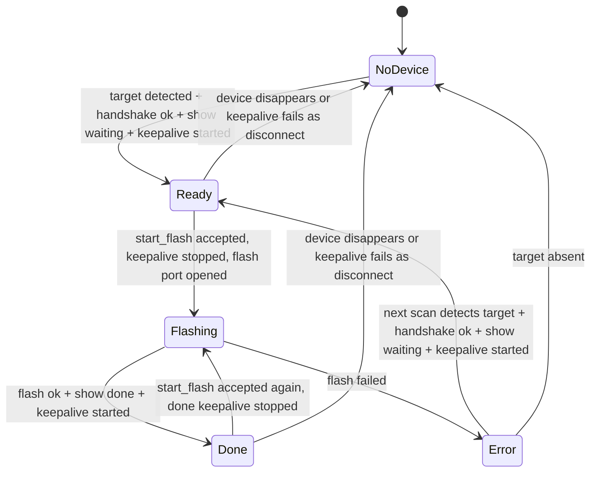

# Flasher Session State Implementation Plan

> **For agentic workers:** REQUIRED SUB-SKILL: Use superpowers:executing-plans to implement this plan task-by-task. Steps use checkbox (`- [ ]`) syntax for tracking.

**Goal:** Rework the flasher runtime so device detection, screen display, keepalive, and flashing share one explicit backend session lifecycle instead of several independent one-shot serial operations.

**Architecture:** Introduce a backend session manager that owns the display state and any keepalive serial session. Scanning only discovers device presence; the session manager decides when to open/close the serial port, when to show `等待写入` or `写入完成`, when to keep the firmware in host-display mode, and when to release the port for flashing. Flash writing remains in `flasher.rs`, but `commands.rs` becomes a thin command layer around the session manager.

**Tech Stack:** Rust/Tauri backend, existing `serialport` crate, existing MSU2 packet helpers, TypeScript frontend.

## Global Constraints

- Keep the current high-speed serial settings: `921600 8N1` with RTS/CTS hardware flow control.
- Preserve the fixed flash layout: offline animation pages `0..3599`, DHCP failed page `3726`, acquiring page `3826`, IP background page `3926`, preserve `4026+`.
- Do not introduce new runtime dependencies.
- The screen is slow; full-screen writes are allowed only on state changes, not for keepalive.
- Keepalive must be a tiny LCD update, preferably one black pixel in a stable corner.
- Flash write operations must have exclusive serial access.
- Device assumption remains one target MSU2 device at a time.
- Existing screen progress behavior should remain best-effort: display failures must not corrupt the flash write path.

---

## Current Failure Model

The current implementation has three independent actors:

- Frontend timer calls `scan_devices` every second.
- `scan_devices` may open a serial port, handshake, directly draw `等待写入`, then close the port.
- `start_flash` later opens a new serial port, handshakes, writes flash, directly draws progress and done, then closes the port.

This causes three classes of bugs:

- `等待写入` and `写入完成` are one-shot LCD writes. The firmware can time out and return to offline animation after no commands arrive.
- Direct LCD writes can leave the firmware in a short transitional state; a later immediate handshake can fail once and succeed on retry.
- Frontend `flashing` is only UI state. The backend does not have one authoritative lifecycle preventing scan, keepalive, and flash from racing for the same serial device.

## Target State Machine

Backend lifecycle:

Display modes:

- `Ready`: full-screen `等待写入`, then keepalive pixel every `800ms`.
- `Flashing`: full-screen `写入中` first, then percentage/progress deltas during flash. No background keepalive thread.
- `Done`: full-screen `写入完成`, then keepalive pixel every `800ms`.
- `Error`: no persistent device-screen requirement for v1; the PC UI shows the error. Next scan recovers to `Ready` if the device remains present.

The `800ms` interval is intentionally below the observed firmware timeout behavior while still light enough to avoid serial noise. If hardware testing shows the timeout is shorter, reduce to `500ms`; do not go below `250ms` unless measured.

## File Structure

- Modify `flasher/src-tauri/src/app_state.rs`
  - Own the backend session state, selected device identity, active display worker handle, and logs.
- Create `flasher/src-tauri/src/session.rs`
  - Implement lifecycle transitions, display worker start/stop, and serial ownership rules.
- Modify `flasher/src-tauri/src/lib.rs`
  - Register the new `session` module.
- Modify `flasher/src-tauri/src/commands.rs`
  - Make Tauri commands delegate to `AppState`/`session` instead of directly opening serial ports.
- Modify `flasher/src-tauri/src/screen_status.rs`
  - Expose full-screen waiting/done displays and keepalive pixel update as reusable operations.
- Modify `flasher/src-tauri/src/flasher.rs`
  - Keep flash writing logic focused; ensure progress display is still best-effort and does not own post-flash keepalive.
- Modify `flasher/src/main.ts`
  - Treat backend status as authoritative; keep frontend `flashing` only for temporary button rendering if still needed.
- Modify `docs/flasher-notes.md`
  - Document the final lifecycle and keepalive behavior.

---

### Task 1: Add Explicit Backend Session State

**Files:**
- Modify: `flasher/src-tauri/src/app_state.rs`
- Create: `flasher/src-tauri/src/session.rs`
- Modify: `flasher/src-tauri/src/lib.rs`

**Interfaces:**
- Produces:
  - `pub enum SessionPhase { NoDevice, Ready, Flashing, Done, Error }`
  - `pub enum DisplayMode { WaitingToFlash, FlashDone }`
  - `pub struct SessionSnapshot { pub phase: SessionPhase, pub port_name: Option<String>, pub vid_pid: Option<String>, pub serial: Option<String>, pub button_enabled: bool, pub title: String }`
  - `impl AppState { pub fn snapshot(&self) -> SessionSnapshot; pub fn set_ready(...); pub fn set_flashing(...); pub fn set_done(...); pub fn set_error(...); pub fn clear_device(...); }`
- Consumes:
  - Existing `UiDeviceStatus` shape, or replaces it with conversion from `SessionSnapshot`.

- [ ] Write tests in `app_state.rs`:
  - `ready_snapshot_enables_flash_button`
  - `flashing_snapshot_disables_flash_button`
  - `done_snapshot_allows_reflash`
  - `clear_device_stops_selected_port`

- [ ] Implement the enum and snapshot storage behind one `Mutex<SessionInner>`.

- [ ] Keep log storage separate from lifecycle storage to avoid holding lifecycle locks while pushing logs.

- [ ] Run:
  - `cargo test app_state::tests -- --nocapture`

Expected: all `app_state` tests pass.

### Task 2: Centralize Display Operations

**Files:**
- Modify: `flasher/src-tauri/src/screen_status.rs`

**Interfaces:**
- Produces:
  - `pub fn show_waiting_to_flash<P: PortIo>(port: &mut P) -> AppResult<()>`
  - `pub fn show_flash_done<P: PortIo>(port: &mut P) -> AppResult<()>`
  - `pub fn keepalive_pixel<P: PortIo>(port: &mut P) -> AppResult<()>`

- [ ] Write tests:
  - `waiting_to_flash_writes_full_screen_and_settles`
  - `flash_done_writes_full_screen_and_settles`
  - `keepalive_pixel_writes_one_black_pixel`

- [ ] Make `show_flash_done` reuse the same full-screen done asset used by `ScreenStatus::finish`.

- [ ] Make `keepalive_pixel` call `write_lcd_region(port, 159, 79, 1, 1, &[0x00, 0x00], RetryPolicy { attempts: 1 })`.

- [ ] Keep `ScreenStatus::probe/start/update/finish` available for flashing progress.

- [ ] Run:
  - `cargo test screen_status::tests -- --nocapture`

Expected: screen status tests pass and keepalive sends only one 1x1 region operation.

### Task 3: Add Display Worker That Owns Ready/Done Serial Sessions

**Files:**
- Modify: `flasher/src-tauri/src/session.rs`
- Modify: `flasher/src-tauri/src/app_state.rs`

**Interfaces:**
- Produces:
  - `pub struct DisplayWorkerHandle`
  - `pub enum DisplayWorkerMode { WaitingToFlash, FlashDone }`
  - `pub fn start_display_worker(app: AppHandle, state: State<AppState>, port_name: String, mode: DisplayWorkerMode) -> AppResult<DisplayWorkerHandle>`
  - `pub fn stop_display_worker(handle: Option<DisplayWorkerHandle>)`

- [ ] Write pure tests for worker lifecycle using a fake worker factory:
  - `starting_ready_worker_records_waiting_mode`
  - `starting_done_worker_records_done_mode`
  - `stopping_worker_is_idempotent`
  - `start_flash_stops_existing_worker_before_opening_flash_port`

- [ ] The real worker must:
  - open the serial port;
  - handshake;
  - show the full-screen mode image;
  - loop until stop signal;
  - send `keepalive_pixel` every `800ms`;
  - on keepalive failure, push a log entry and clear device state if the state still points to that port.

- [ ] The worker must own the serial port for the whole ready/done display session.

- [ ] The stop path must signal the worker and join it before flash opens the port.

- [ ] Run:
  - `cargo test session::tests -- --nocapture`

Expected: worker lifecycle tests pass without real hardware.

### Task 4: Rewire Scan To Discover, Not Continuously Touch, Ready Devices

**Files:**
- Modify: `flasher/src-tauri/src/commands.rs`
- Modify: `flasher/src-tauri/src/session.rs`

**Interfaces:**
- `scan_devices` uses `scan_candidates`.
- If state is `Ready` or `Done` and the selected port is still present, return the snapshot without opening a port.
- If selected port disappears, stop display worker and clear state.
- If state is `NoDevice` or `Error` and a target appears, start the display worker in `WaitingToFlash` mode and return `Ready`.

- [ ] Write command/session tests:
  - `scan_starts_waiting_worker_for_new_device`
  - `scan_does_not_reopen_existing_ready_device`
  - `scan_does_not_reopen_existing_done_device`
  - `scan_clears_state_when_selected_port_disappears`
  - `scan_recovers_error_to_ready_when_device_remains`

- [ ] Remove direct `show_waiting_to_flash` use from `scan_devices_with`; it should be inside worker startup.

- [ ] Run:
  - `cargo test commands::tests session::tests -- --nocapture`

Expected: scan no longer opens a ready/done port every second.

### Task 5: Rewire Flash Start Around Exclusive Serial Ownership

**Files:**
- Modify: `flasher/src-tauri/src/commands.rs`
- Modify: `flasher/src-tauri/src/session.rs`
- Modify: `flasher/src-tauri/src/flasher.rs` only if needed to return cleaner completion metadata.

**Interfaces:**
- `start_flash` must:
  - read selected port from session state;
  - reject if `NoDevice` or `Flashing`;
  - stop any display worker and wait for serial release;
  - mark state `Flashing`;
  - run `run_flash_sequence`;
  - on success, start display worker in `FlashDone` mode and mark state `Done`;
  - on failure, mark `Error`, emit failure, and let the next scan recover.

- [ ] Write tests:
  - `start_flash_rejects_no_device`
  - `start_flash_rejects_already_flashing`
  - `start_flash_stops_ready_keepalive_before_flash`
  - `successful_flash_starts_done_keepalive`
  - `failed_flash_marks_error_and_does_not_start_done_keepalive`

- [ ] Keep progress display during flash exactly as it is: `flash_images_with_screen_status` still writes start/progress/done while flash owns the port.

- [ ] Do not call `preview_pages` after success.

- [ ] Run:
  - `cargo test commands::tests flasher::tests session::tests -- --nocapture`

Expected: flash path has exclusive serial ownership and starts done keepalive only after success.

### Task 6: Make Frontend Follow Backend State

**Files:**
- Modify: `flasher/src/main.ts`

**Interfaces:**
- Backend still emits `device-status-changed`, `flash-progress`, `flash-finished`, `flash-failed`.
- Frontend should not rely on local `flashing` to define backend truth.

- [ ] Add a local `backendPhase` or derive from returned `UiDeviceStatus.kind`.

- [ ] Keep the scan timer, but render backend status as authoritative.

- [ ] Disable the write button when backend says `button_enabled=false`, including `Flashing`.

- [ ] On `flash-finished`, allow button text `重新写入`, but the next scan should preserve `Done` instead of forcing `Ready`.

- [ ] Run:
  - `npm run build`

Expected: TypeScript build passes.

### Task 7: Update Docs and Remove Obsolete Assumptions

**Files:**
- Modify: `docs/flasher-notes.md`
- Modify: `docs/msu2-protocol-and-flash-layout.md` only if flash layout text needs adjustment.

- [ ] Document the new lifecycle:
  - `NoDevice`: enumeration only.
  - `Ready`: waiting image plus keepalive.
  - `Flashing`: exclusive flash port plus progress display.
  - `Done`: done image plus keepalive.
  - `Error`: PC UI error, next scan recovers.

- [ ] Document why keepalive exists: MSU2 firmware returns to offline animation without periodic host commands.

- [ ] Document that keepalive is one pixel and full-screen images are only written on state changes.

### Task 8: Full Verification and Test Build

**Files:**
- No source edits unless tests expose a defect.

- [ ] Run:
  - `cargo test`
  - `npm run build`
  - `npm run tauri -- build`

- [ ] If `target/release/msu2-flasher.exe` is locked by a running flasher, build with:
  - PowerShell: `$env:CARGO_TARGET_DIR='D:\Work\miniboard\codex-artifacts\flasher-session-target'; npm run tauri -- build`

- [ ] Manual hardware acceptance:
  - Start flasher with device absent: PC shows no device; screen offline animation runs.
  - Plug device: screen shows `等待写入` and remains there for at least 2 minutes.
  - Click write immediately after detection: first attempt starts writing, no one-click failure.
  - During writing: device shows progress and PC UI remains responsive.
  - After writing: screen shows `写入完成` and remains there for at least 2 minutes while device stays plugged and flasher stays open.
  - Click `重新写入`: done keepalive stops and flashing starts.
  - Unplug in `Ready` or `Done`: UI returns to no device within scan interval.

Expected: automated tests pass, build succeeds, and manual hardware acceptance matches all bullets.

## Design Notes

- Holding the serial port during `Ready` and `Done` is intentional. The screen display state requires periodic commands; opening and closing the port each tick is more likely to reintroduce handshake timing problems.
- Flashing must stop the keepalive worker before opening the port. This avoids `PortBusy` and prevents keepalive packets from interleaving with flash erase/write packets.
- Keepalive failure should be treated as disconnect if the selected port still matches the worker's port. This prevents stale `Ready`/`Done` UI.
- Do not add custom page allocations for `等待写入` or `写入完成`; they remain direct LCD assets, not flashed assets.
- `preview_pages` can remain as a test/debug helper but must not run in the normal post-flash path.

## Open Decisions

- Keepalive interval starts at `800ms`; hardware testing can lower it to `500ms` if the display still times out.
- Error state display on the device is out of scope for this cleanup. The PC UI already reports errors, and adding an error display would require deciding whether errors should persist like `Done`.
